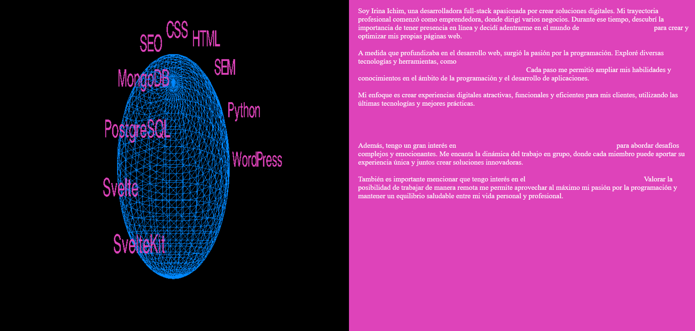

# Galería 3D y Presentación Personal

Este proyecto consiste en una galería 3D interactiva y una presentación personal. La galería 3D muestra palabras clave relacionadas con tecnología que giran alrededor de una esfera. La presentación personal detalla la trayectoria y habilidades de la desarrolladora.

## Captura de Pantalla



## Contenido

- [Descripción](#descripcion)

- [Instrucciones de Uso](#instrucciones-de-uso)

- [Requisitos](#requisitos)

- [Créditos](#creditos)

- [Licencia](#licencia)

## Descripción

El proyecto consta de dos partes principales:

1. **Galería 3D**: En esta parte, se crea una escena 3D con una esfera en la que las palabras clave relacionadas con tecnología se muestran en 3D alrededor de la esfera.
2. **Presentación Personal**: Esta parte contiene una breve presentación personal de Irina Ichim, una desarrolladora full-stack, incluyendo su experiencia, habilidades y enfoque profesional.

## Instrucciones de Uso

1. Clona este repositorio en tu máquina local:

   ```bash
   git clone https://github.com/Irina-Ichim/Pruebas
   ```

2. Abre el archivo `index.html` en tu navegador para ver la galería 3D y la presentación personal.

## Requisitos

Para ejecutar este proyecto, necesitarás un navegador web moderno que admita las tecnologías utilizadas, como HTML5, CSS3 y JavaScript. No se requiere ninguna instalación adicional.

## Créditos

Este proyecto utiliza la biblioteca [Three.js](https://threejs.org/) para crear la escena 3D y [Google Fonts](https://fonts.google.com/) para la fuente utilizada en la presentación personal.

- Desarrolladora: Irina Ichim
- Tres.js: [https://threejs.org/](https://threejs.org/)
- Fuente utilizada: [Playfair Display](https://fonts.google.com/specimen/Playfair+Display)
